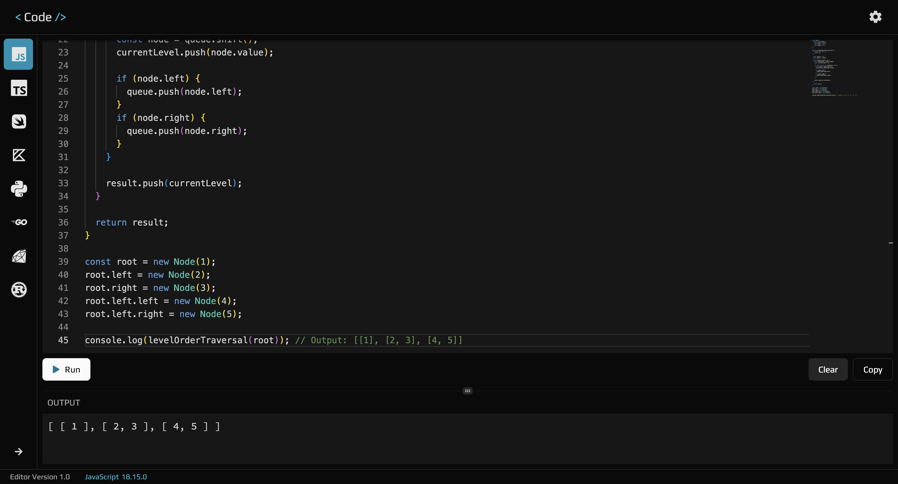

## Code Editor

This is a browser based code editor that can be used to run small code snippets.

_Check it out live [here](https://code-editor-lwkgli7mu-brandondykuns-projects.vercel.app/)!_

This app uses Next.js, Piston API, and was deployed on Vercel.

 
 

Languages available in the code editor are:
- JavaScript
- TypeScript
- Swift
- Kotlin
- Python
- Go
- Ruby
- Rust
